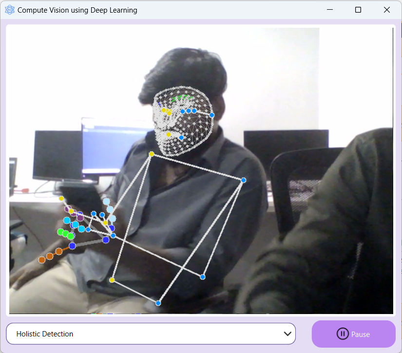
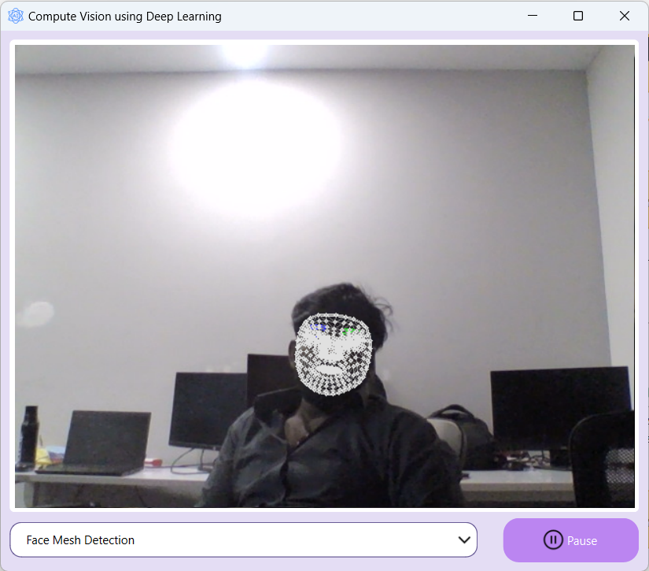
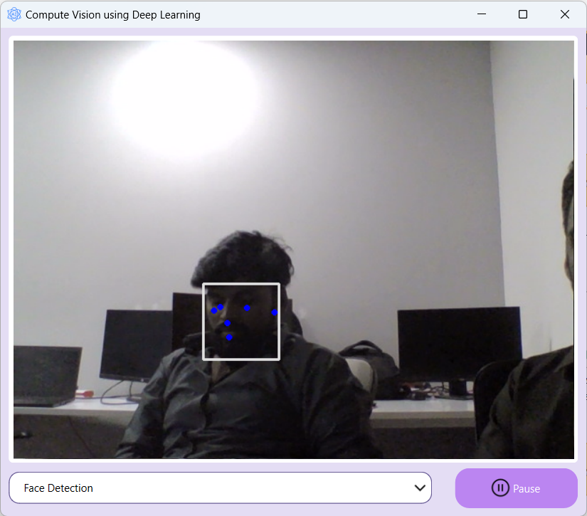

# Computer Vision with [MediaPipe](https://ai.google.dev/edge/mediapipe)

## Previews

## Building Steps

1. Clone this project and open this project directory in terminal.
2. Sync project: `rye sync`
3. Activate environment
    * On Windows, run: `.venv\Scripts\activate/`
    * On Unix or MacOS, run: `source .venv/bin/activate`
4.
    1. To build installer run: `rye run build-installer`
    2. To build binary run: `rye run build-binary`

> [!NOTE]
> 1. Project managed by [Rye](https://rye-up.com), Install Rye using following instructions https://rye-up.com/guide/installation.
> 
> 2. [cargo-packager](https://github.com/crabnebula-dev/cargo-packager) is required to build installer.
